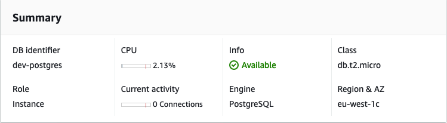
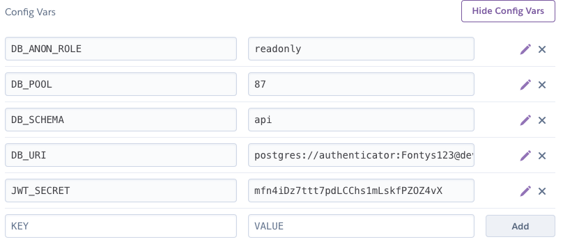

# Deployment
It's time to deploy the database and API to the cloud. We selected two renowned cloud providers that offer free tiers and provide sufficient configuration options. The PostgreSQL database will be hosted on Amazon Relational Database Service (RDS). With Amazon RDS you can set up, operate, and scale a relational database in the cloud with just a few clicks [4]. The PostgREST API will be hosted on Heroku. We provide you with an up-to-date buildpack which makes deployment pretty straighforward.

## 1. Deploy PostgreSQL to RDS
Log in to the Amazon AWS Console, click on _RDS_ in the dropdown menu and select _Create database_. Make sure that you select _Free tier_ when creating the database to generating any costs. Write down the database credentials and make sure you store them in a safe place, as they will be only visible once. When the instance has been successfully created, you will see something like this in your dashboard:

In our case the created endpoint is `dev-postgres.cperpcjgj3fr.eu-west-1.rds.amazonaws.com`, you can find your own unique endpoint in your AWS dashboard. Use this endpoint and your credentials in _docker-compose.yml_, _postgrest.conf_ and, later, in your Heroku Config Vars. You can connect to the database using pgAdmin, DataGrip or any other database tool of choice. Run the SQL examples from this tutorial in the console and your database will be populated with all the presidents' data and required roles and permissions.

**Note:** If you can't connect to the database, you'll probably need to whitelist PostgreSQL traffic on port 5432 in the AWS firewall: you can find this in the _inbound_ security group in your dashboard.

---

## 2. Deploy PostgREST to Heroku
Log in to the [Heroku dashboard](https://dashboard.heroku.com) and create a new personal app. When the app is provisioned, you need to provide a buildpack and some configuration variables for deployment. Head over to the _Settings_ tab and add buildpack `https://github.com/koenberkhout/dev-postgrest-buildpack`. Next, fill in the Config Vars as shown in the image below. Use the values from this tutorial, or some custom values if you're building your own app.

Lastly, you'll need to deploy the PostgREST app on Heroku. Head over to the _Deploy_ tab and select GitHub. This is necessary for automatic or manual deployment of the app. Since we use the buildpack and Config Vars, the GitHub repository you use here may be empty. It just needs to be there. Select _Deploy_ and put your API to the test.